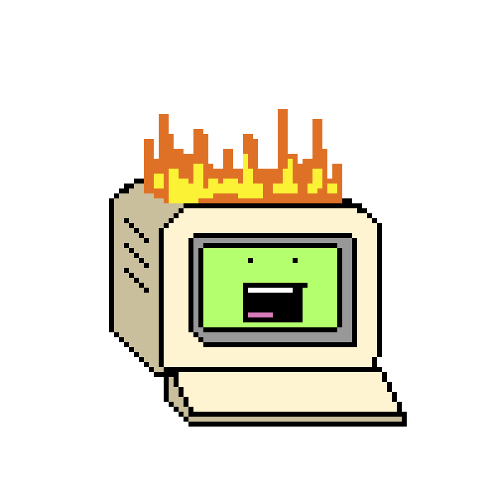
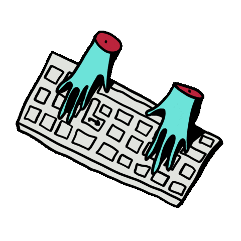
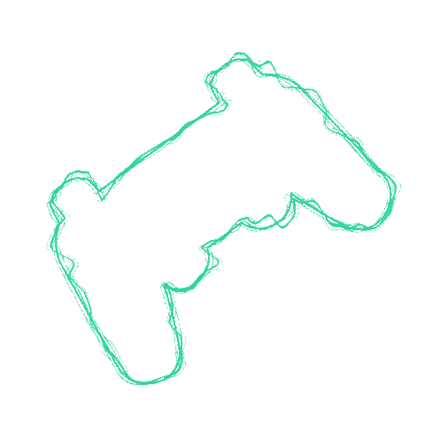

<h1 align="center"><b>Hi there, i'm Gabriel! 👋</b></h1>

### <picture></picture> Talking about my stack...

I am currently maintaining 3 clients with the company, all involving the stack below:

- Experience with the development of WebApps w/ React.js + Typescript;
- Practice with the development of LowCode Apps w/ FlutterFlow;
- Experience w/ the development of RESTFUL APIs w/ Java & Spring Boot (modern practices w/ Tests, Pagination, Health Check...);
- Experience w/ the development of RESTFUL APIs (Servless containers & Edge Functions) w/ Node.js / Typescript / Express;
  - Servless Back End & Netlify Edge Functions
- SQL w/ MS-SQL Server / PostgreSQL / Supabase;
- No-SQL with Firebase;
- Data modeling w/ CASE tools like Power Designer and others;
- Pipeline CI/CD flow with Netlify & Github / Gitlab & Jenkins / others;

<picture></picture>

### <picture></picture> I’m currently learning...

- Full Stack Development;
- DevOps Culture;
- Design Patterns;
- Restful API's;
- Servless API's;
- Edge Functions; 
- Modern development practices;

  

### <picture></picture> My Tech Stack

### <picture></picture> Affinity with...

### <picture></picture> My working tools...

### <picture></picture> Contact me!

### <picture></picture> Let's Play?

<link rel="stylesheet" href="https://fonts.googleapis.com/css2?family=Material+Symbols+Outlined:opsz,wght,FILL,GRAD@20..48,100..700,0..1,-50..200" />
